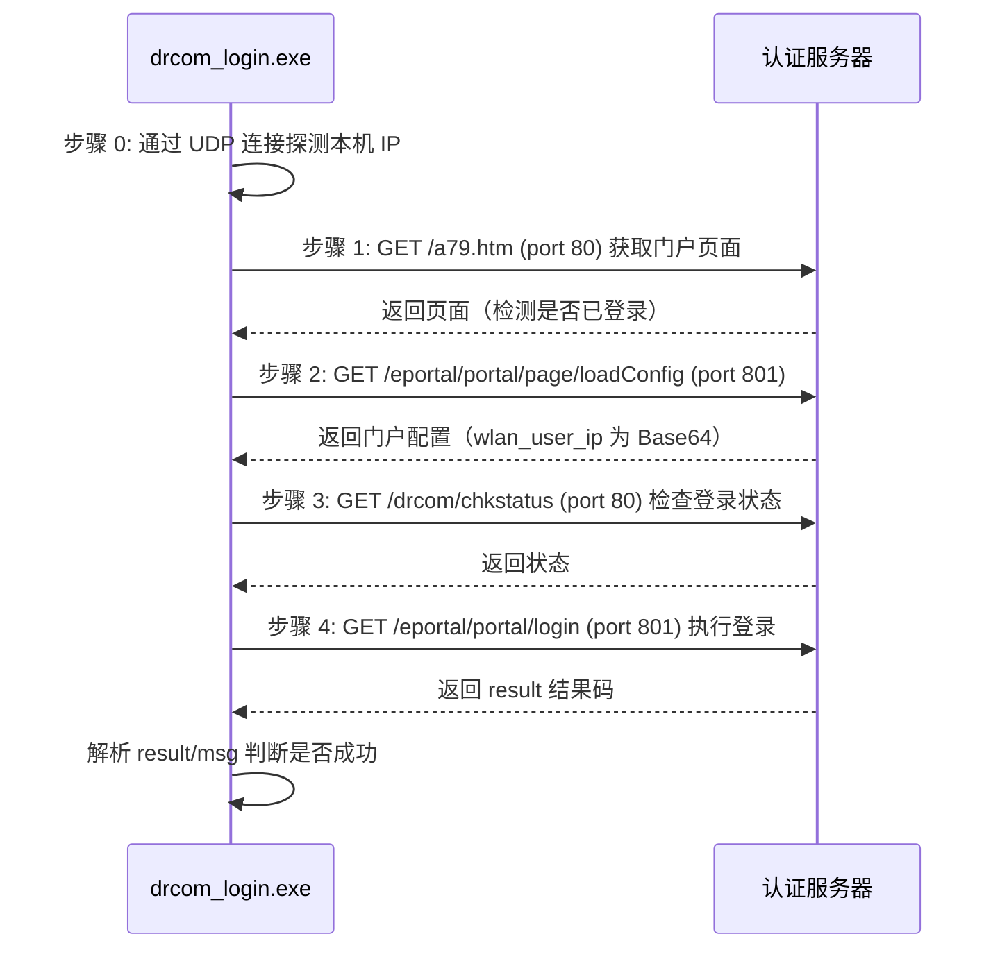

# CCSU-Campus-Network-Login

> 长沙学院（CCSU）校园网 Dr.COM 4.0 一键登录程序（Windows / C 语言）

一个轻量、无依赖的校园网自动登录工具。基于对 Dr.COM 4.0 认证门户的协议分析，使用纯 C 语言 + Winsock 实现 HTTP 认证流程，编译后为单个 `exe`，双击即可联网。

---

## ✨ 功能特性

- 🚀 **一键登录**：双击运行，自动读取配置完成认证，无需打开浏览器。
- 🔐 **账号外置**：账号密码保存在 `drcom.conf`，不硬编码进程序，方便分享源码。
- 🧩 **模块化设计**：网络、协议、配置、工具函数分层解耦，便于二次开发。
- ⚙️ **灵活调用**：支持命令行参数、环境变量、配置文件三种方式指定账号。
- 🖥️ **原生控制台**：UTF-8 源码 + GBK 输出，中文提示在 CMD 下正常显示。
- 🎨 **首次配置向导**：`setup_first_login.bat` 一键完成图标设置 + 账号写入。
- 📦 **零第三方依赖**：仅使用 Windows 自带 Winsock2，编译产物可直接分发。

---

## 🖥️ 环境要求

| 项目 | 要求 |
| --- | --- |
| 操作系统 | Windows 7 / 10 / 11（x86 / x64） |
| 编译器 | MinGW-w64（`gcc`）或 MSVC（`cl`） |
| 构建工具 | `mingw32-make` / `make`（可选） |
| 网络 | 已连接到校园网（未认证状态） |

> 只需要运行程序的用户**无需**安装编译器——直接下载 Release 中的 `drcom_login.exe` 即可（如提供）。

---

## 🚀 快速开始

### 方式一：一键配置（推荐新手）

1. 下载或克隆本仓库到本地（路径尽量不要含空格）。
2. 双击运行 **`setup_first_login.bat`**。
3. 按提示依次输入：
   - **学号 / 账号**：例如 `2025xxxxxx`
   - **密码**：你的校园网密码
   - **运营商后缀**：`unicom`（联通）/ `dx`（电信）/ `yd`（移动），直接回车默认 `unicom`
4. 脚本会自动：
   - 将 `drcom_login.ico` 图标嵌入 `drcom_login.exe`（需已安装 MinGW）；
   - 在桌面创建带图标的「校园网一键登录」快捷方式；
   - 生成配置文件 `drcom.conf`。
5. 以后双击桌面快捷方式或 `drcom_login.exe` 即可一键登录。

### 方式二：手动配置

1. 复制模板并重命名：

   ```bat
   copy drcom.conf.example drcom.conf
   ```

2. 用记事本编辑 `drcom.conf`，填写 `username` / `password` / `suffix`。
3. 编译并运行（见下文「编译」）。

---

## 📁 目录结构

```text
CCSU-Campus-Network-Login/
├── include/                  # 头文件
│   ├── config.h              # 全局常量（服务器地址、端口、缓冲区大小）
│   ├── config_reader.h       # 配置文件读取模块声明
│   ├── login.h               # 登录协议模块声明
│   ├── network.h             # 网络通信模块声明
│   └── utils.h               # 工具函数声明
├── src/                      # 源文件
│   ├── main.c                # 程序入口、命令行解析
│   ├── config_reader.c       # drcom.conf 解析与自动搜索
│   ├── login.c               # Dr.COM 认证协议实现（4 步流程）
│   ├── network.c             # HTTP GET 客户端、本机 IP 探测
│   └── utils.c               # URL 编码、Base64、UTF-8/GBK 转换
├── Makefile                  # 构建脚本（支持 MinGW / MSVC）
├── drcom_login.ico           # 程序图标
├── drcom_login.rc            # 图标资源脚本
├── drcom.conf.example        # 配置文件模板（不含真实账号）
├── setup_first_login.bat     # 首次配置向导（图标 + 账号）
├── .gitignore
├── LICENSE
└── README.md
```

---

## 🔨 编译

### MinGW（推荐）

```bat
make
```

或手动单条命令编译：

```bat
gcc -O2 -Wall -Iinclude src\config_reader.c src\login.c src\main.c src\network.c src\utils.c -o drcom_login.exe -lws2_32 -finput-charset=UTF-8 -fexec-charset=GBK
```

> `-finput-charset=UTF-8 -fexec-charset=GBK` 用于保证源码中的中文在 CMD 下正确显示。

### MSVC

```bat
make MSVC=1
```

或：

```bat
cl /O2 /W3 /Iinclude src\*.c /Fe:drcom_login.exe ws2_32.lib
```

### 其他 Make 目标

| 命令 | 说明 |
| --- | --- |
| `make` | 编译（MinGW） |
| `make MSVC=1` | 使用 MSVC 编译 |
| `make DEBUG=1` | 编译调试版（`-O0 -g -DDEBUG`） |
| `make run` | 编译并运行 |
| `make clean` | 清理 `build/` 目录 |
| `make help` | 显示帮助 |

### 带图标编译

```bat
windres drcom_login.rc -O coff -o drcom_login.res
gcc -O2 -Wall -Iinclude src\*.c drcom_login.res -o drcom_login.exe -lws2_32 -finput-charset=UTF-8 -fexec-charset=GBK
```

---

## ⚙️ 配置文件 `drcom.conf`

INI 风格，支持 `#` 与 `;` 注释、空行，等号两侧空格可选。

```ini
; ---------- 账号信息（必填） ----------
username = 2025xxxxxx
password = your_password
suffix   = unicom

; ---------- 服务器配置（可选，一般无需修改） ----------
server        = 10.0.100.3
port_http     = 80
port_portal   = 801
ac_name       = ME60-CSDX
js_version    = 4.2.1
terminal_type = 1
```

**配置文件搜索顺序**（`config_auto_load`）：

1. 环境变量 `DRCOM_CONF` 指定的路径；
2. `drcom_login.exe` 所在目录下的 `drcom.conf`；
3. 当前工作目录下的 `drcom.conf`。

> ⚠️ `drcom.conf` 含**明文密码**，已被 `.gitignore` 忽略，请勿上传或分享。

---

## 💻 命令行用法

```bat
drcom_login.exe                                从 drcom.conf 读取账号登录
drcom_login.exe --fast                         快速模式（单步直达）
drcom_login.exe <用户名> <密码> [后缀]           使用指定账号登录
drcom_login.exe --conf <路径>                  指定配置文件
drcom_login.exe --help                         显示帮助
```

**示例：**

```bat
rem 读取 drcom.conf 登录
drcom_login.exe

rem 快速登录
drcom_login.exe --fast

rem 命令行直接指定账号
drcom_login.exe 2025xxxxxx your_password unicom

rem 使用自定义配置文件
drcom_login.exe --conf D:\my\drcom.conf
```

**返回码：**

| 返回码 | 含义 |
| --- | --- |
| `0` | 登录成功（或账号已在线） |
| `1` | 登录失败（认证失败 / 网络错误 / 缺少配置） |

---

## 🔍 工作原理

程序基于对 Dr.COM 4.0 认证门户的流程分析，完整登录共 **4 步**（`--fast` 模式跳过前置检查直接登录）：



**结果判定（`parse_login_result`）：**

| `result` / `ret_code` | 含义 |
| --- | --- |
| `result = 1` | 登录成功 |
| `result = 2` 或 `ret_code = 2` | 账号已在线 |
| `result = 0` 且非上述 | 认证失败（账号 / 密码 / 后缀错误） |

**关键实现点：**

- 账号格式化为 `,0,用户名@后缀`（无后缀时为 `,0,用户名`），再进行 URL 编码；
- `loadConfig` 请求中的 `wlan_user_ip` 需先 Base64 再 URL 编码；
- 响应可能被 `dr1003({...})` 回调包裹，解析时会自动剥离外层；
- 兼容 `Transfer-Encoding: chunked` 响应体；
- 服务器返回 UTF-8，输出前统一转换为 GBK 以适配 CMD。

---

## ❓ 常见问题（FAQ）

**Q1：提示「未找到配置文件 drcom.conf」？**
运行 `setup_first_login.bat` 生成，或复制 `drcom.conf.example` 为 `drcom.conf` 后填写。

**Q2：提示「认证失败，请检查账号/密码/后缀」？**
- 检查密码是否正确；
- 检查 `suffix` 是否与运营商匹配（`unicom` / `dx` / `yd`）；
- 确认已连接校园网 Wi-Fi / 网线。

**Q3：提示「无法获取本机 IP」？**
请确认已连接校园网。程序通过 UDP 连接到认证服务器来确定出口网卡，未联网时会失败。

**Q4：中文显示乱码？**
确保编译时带有 `-fexec-charset=GBK`；在 CMD 中可执行 `chcp 936` 切换代码页。

**Q5：双击后窗口一闪而过？**
正常流程结束时程序会等待按键。若在脚本中调用，可用 `login_delayed.bat` 的写法并自行加 `pause`。

**Q6：想开机自动登录？**
新建一个 `startup.bat`，内容如下（延迟 5 秒等待网络就绪后调用程序），再把它放入「启动」文件夹或加入计划任务即可：

```bat
@echo off
timeout /t 5 /nobreak >nul
"%~dp0drcom_login.exe"
```

**Q7：图标没有生效？**
嵌入图标需要 MinGW（`windres` + `gcc`）。若未安装，脚本会退化为仅设置桌面快捷方式图标。

---

## 🔒 安全与隐私提示

- `drcom.conf` 保存**明文账号密码**，已加入 `.gitignore`，**请勿提交到任何公开仓库**；
- 分享本项目或排查问题时，请先删除 / 清空 `drcom.conf`；
- 本程序仅在本地进行 HTTP 认证请求，不会将账号信息发送到除校园网认证服务器以外的任何地方。

---

## ⚠️ 免责声明

本项目仅供**长沙学院在校师生学习交流**使用，用于个人正常连接校园网。

- 请勿将本程序用于任何商业用途或非法用途；
- 使用本程序所产生的一切后果由使用者自行承担；
- 请遵守学校网络管理规定，合理、合规地使用校园网资源；
- 认证接口与协议可能随学校升级而变更，届时程序可能失效。

---

## 📄 许可证

本项目基于 **BSD-3-Clause License** 开源，详见 [LICENSE](LICENSE)。
